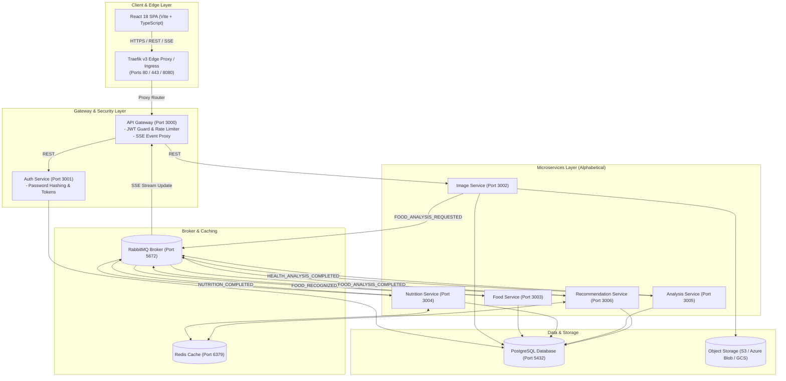

# FoodLens AI - Microservices Food & Nutrition Platform

[](https://github.com/your-org/AI_Food/actions/workflows/ci.yml)
[](https://github.com/your-org/AI_Food/actions/workflows/docker-publish.yml)
[](https://github.com/your-org/AI_Food/actions/workflows/terraform-ci.yml)
[](LICENSE)

**FoodLens AI** is an enterprise-grade, cloud-native microservices platform for AI-powered food identification, nutritional analysis, recipe recommendations, and health insights.

---

## 📐 System Architecture Diagram



---

## 🏗️ Repository Directory Layout (Alphabetical Order)

```
AI_Food/
├── README.md                                # Platform overview & getting started guide
│
├── application/                             # Core Application Workspace
│   ├── .github/workflows/                   # GitHub Actions CI/CD (CI, Docker, Terraform)
│   ├── apps/                                # React Frontend Web Application (Vite/TypeScript)
│   ├── infra/                               # Infrastructure & DevOps Suites
│   │   ├── argocd/                          # ArgoCD GitOps Manifests & ApplicationSets
│   │   ├── helm/                            # Kubernetes Helm Chart (`foodlens-ai`)
│   │   ├── monitoring/                      # Observability (Dynatrace, ELK, Loki, Prometheus)
│   │   └── terraform/                       # Multi-Cloud IaC (AWS, Azure, GCP)
│   ├── packages/                            # Shared Configs, Types & Utilities
│   ├── prisma/                              # PostgreSQL Database Schema & Seeders
│   ├── scripts/                             # Deployment Scripts (`deploy_azure_aca.sh`)
│   ├── services/                            # 7 Node.js/TypeScript Microservices (Alphabetical)
│   │   ├── analysis-service/                # AI Vision Processing Engine (Port 3005)
│   │   ├── api-gateway/                     # Public Ingress Router & JWT Auth Proxy (Port 3000)
│   │   ├── auth-service/                    # User Accounts & Token Lifecycle (Port 3001)
│   │   ├── food-service/                    # Food Catalog & Recipes (Port 3003)
│   │   ├── image-service/                   # Image Processing & Blob Storage (Port 3002)
│   │   ├── nutrition-service/               # Macronutrient Engine (Port 3004)
│   │   └── recommendation-service/          # Dietary & Recipe Recommendation (Port 3006)
│   ├── docker-compose.yml                   # Local Multi-Container Development (with Traefik v3)
│   └── package.json                         # Workspace Scripts
│
└── docs/                                    # Central Documentation Portal (Alphabetical)
    ├── README.md                            # Documentation Index
    ├── api.md                               # REST API Endpoints & Gateway Routing
    ├── architecture.md                      # System Architecture & Component Interactions
    ├── database.md                          # PostgreSQL Entity Relationships & Schema
    ├── events.md                            # RabbitMQ Event Schemas & Topics
    ├── SECURITY.md                          # Security Policy & Vulnerability Reporting
    ├── aws/                                 # 11-Step Production AWS Guide (ECS, Fargate)
    ├── azure/                               # 11-Step Production Azure Guide (ACA, PaaS)
    └── gcp/                                 # 11-Step Production GCP Guide (Cloud Run)
```

---

## ⚡ Quick Start (Local Development)

Launch the complete platform locally using Docker Compose & Traefik v3:

```bash
cd application
npm install
docker compose up -d
```

### Local Endpoint Map:
- **API Gateway**: `http://localhost:3000`
- **PostgreSQL Database**: `localhost:5433` (foodlens_user/foodlens_password)
- **RabbitMQ Management**: `http://localhost:15672` (guest/guest)
- **React Frontend**: `http://localhost:5173`
- **Traefik v3 Proxy Dashboard**: `http://localhost:8080`

---

## ☁️ Multi-Cloud & DevOps Suites (Alphabetical Order)

### 1. Amazon Web Services (AWS)
- IaC: [`application/infra/terraform/aws`](file:///Users/aarvik/Documents/AI_Food/application/infra/terraform/aws) (ECS Fargate, RDS PostgreSQL, ElastiCache Redis, S3)
- Guide: [`docs/aws/README.md`](file:///Users/aarvik/Documents/AI_Food/docs/aws/README.md)

### 2. Microsoft Azure
- IaC: [`application/infra/terraform/azure`](file:///Users/aarvik/Documents/AI_Food/application/infra/terraform/azure) (Azure Container Apps, PostgreSQL Flexible Server, Redis, Key Vault)
- Guide: [`docs/azure/README.md`](file:///Users/aarvik/Documents/AI_Food/docs/azure/README.md)

### 3. Google Cloud Platform (GCP)
- IaC: [`application/infra/terraform/gcp`](file:///Users/aarvik/Documents/AI_Food/application/infra/terraform/gcp) (Cloud Run, Cloud SQL PostgreSQL, Memorystore Redis, GCS)
- Guide: [`docs/gcp/README.md`](file:///Users/aarvik/Documents/AI_Food/docs/gcp/README.md)

---

## 📖 Comprehensive Documentation (Alphabetical Order)

For detailed production deployment guides, refer to the [`docs/`](file:///Users/aarvik/Documents/AI_Food/docs) folder:
- 📡 **API Reference**: [`docs/api.md`](file:///Users/aarvik/Documents/AI_Food/docs/api.md)
- 📐 **Architecture Specification**: [`docs/architecture.md`](file:///Users/aarvik/Documents/AI_Food/docs/architecture.md)
- 🟧 **AWS Production Guide**: [`docs/aws/README.md`](file:///Users/aarvik/Documents/AI_Food/docs/aws/README.md)
- 🔵 **Azure Production Guide**: [`docs/azure/README.md`](file:///Users/aarvik/Documents/AI_Food/docs/azure/README.md)
- 🗄️ **Database Schema**: [`docs/database.md`](file:///Users/aarvik/Documents/AI_Food/docs/database.md)
- 📡 **Event Schemas**: [`docs/events.md`](file:///Users/aarvik/Documents/AI_Food/docs/events.md)
- 🔴 **GCP Production Guide**: [`docs/gcp/README.md`](file:///Users/aarvik/Documents/AI_Food/docs/gcp/README.md)
- 🛡️ **Security Policy**: [`docs/SECURITY.md`](file:///Users/aarvik/Documents/AI_Food/docs/SECURITY.md)
