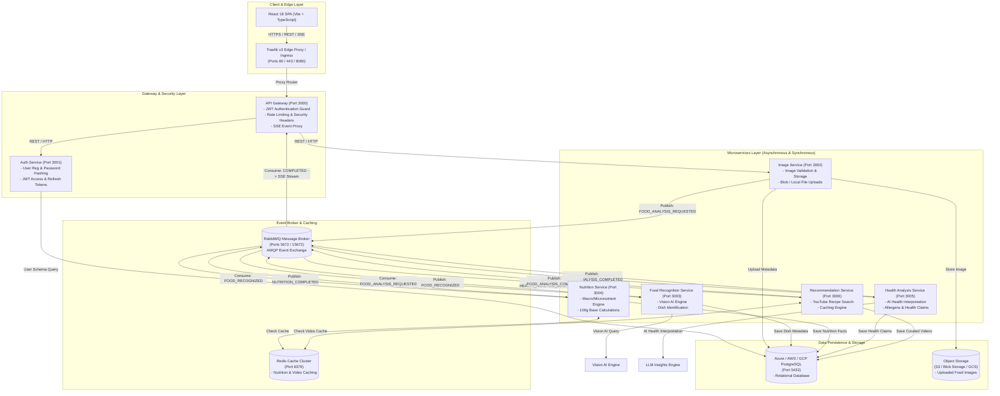
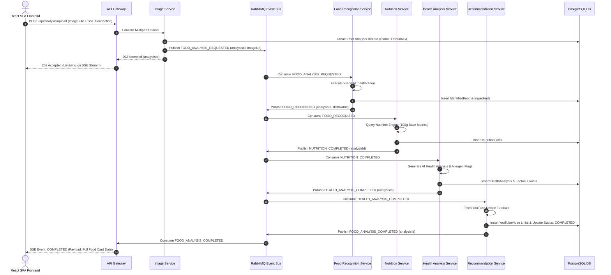
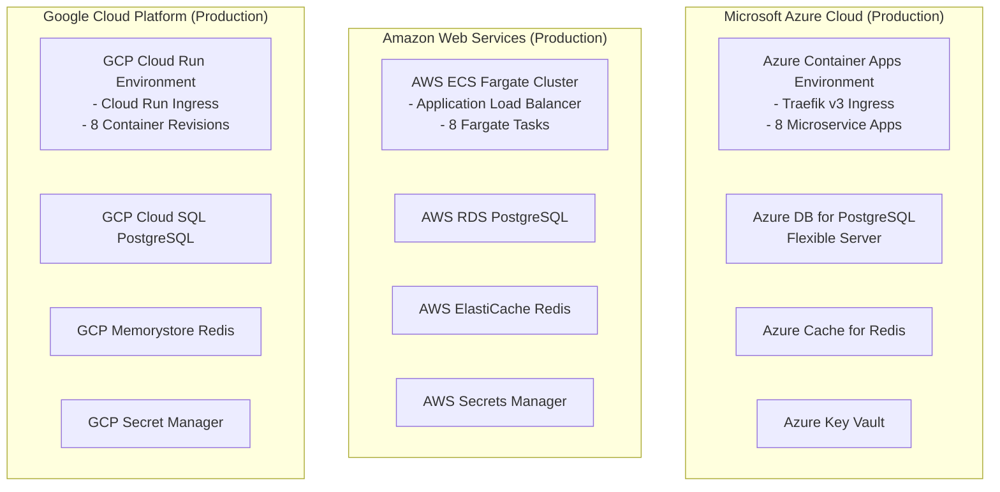

# FoodLens AI - Comprehensive Platform Architecture & Flow Diagrams

This document contains full architectural specifications, component interaction diagrams, event-driven async flow sequences, and multi-cloud infrastructure models for **FoodLens AI**.

---

## 1. Complete Microservices Architecture Diagram

---

## 2. Event-Driven Workflow Sequence Diagram

---

## 3. Multi-Cloud Deployment Architecture

