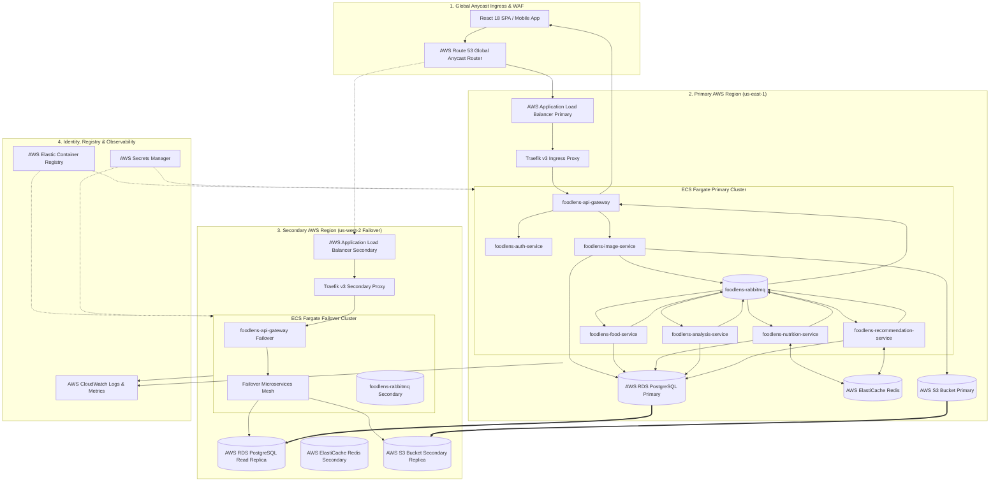
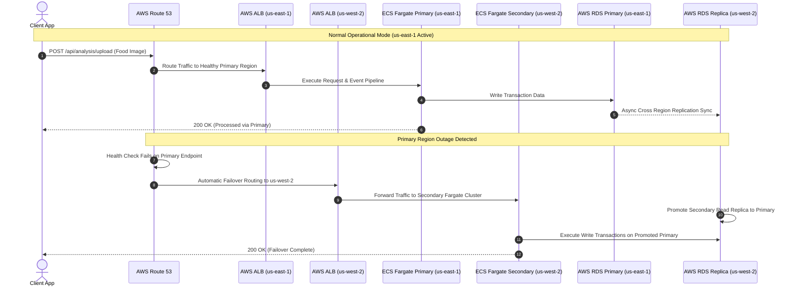

# AWS Multi-Region End-to-End Architecture & Flow Diagram

This document contains visual Mermaid flowchart and sequence diagrams detailing the multi-region active-active/failover architecture, request routing, microservices processing, and data persistence on **Amazon Web Services (AWS)**.

---

## 📐 1. AWS Multi-Region Architecture & Flowchart Diagram



---

## ⚡ 2. AWS Multi-Region Execution Flow Chart

```
[ Client / React SPA ]
         │ (1. HTTPS Request)
         ▼
[ AWS Route 53 ] ── (2. Latency-Based Routing & Failover)
         │
         ├─── (Active Primary Path) ────────────────────────────────────────────────────────┐
         │                                                                                  │
         ▼ (us-east-1 Primary)                                                              ▼ (us-west-2 Failover)
[ AWS Application Load Balancer ]                                                  [ AWS ALB Secondary ]
         │                                                                                  │
         ▼                                                                                  ▼
[ Traefik v3 Primary Proxy ]                                                       [ Traefik v3 Secondary Proxy ]
         │                                                                                  │
         ▼                                                                                  ▼
[ API Gateway Primary (Fargate) ]                                                  [ API Gateway Secondary (Fargate) ]
         │                                                                                  │
         ├───► [ Auth Service (Fargate) ] ──► [ AWS RDS PostgreSQL ]                       │
         │                                           ▲                                      │
         └───► [ Image Service (Fargate) ] ─► [ S3 Bucket (CRR) ]                   (Read Replica DB & Storage Sync)
                         │                           │                                      │
                         ▼ (FOOD_ANALYSIS_REQUESTED) │                                      │
           [ RabbitMQ Event Broker ]                 │                                      │
                         │                           │                                      │
   ┌─────────────────────┼─────────────────────┐     │                                      │
   ▼                     ▼                     ▼     │                                      │
[ Food Service ]  [ Nutrition Svc ]  [ Analysis Svc ]  │                                      │
   │                     │                     │     │                                      │
   ▼                     ▼                     ▼     │                                      │
[ AWS RDS Postgres ] [ ElastiCache ] [ AWS RDS Postgres]                                  │
   │                     │                     │     │                                      │
   └─────────────────────┼─────────────────────┘     │                                      │
                         │ (Event Chain)             │                                      │
                         ▼                           │                                      │
           [ Recommendation Service (Fargate) ]      │                                      │
                         │                           │                                      │
                         ▼ (FOOD_ANALYSIS_COMPLETED) │                                      │
           [ API Gateway Primary (Fargate) ]         │                                      │
                         │                           │                                      │
                         ▼ (Real-Time SSE Stream)    │                                      │
               [ Client / React SPA ] ───────────────┴──────────────────────────────────────┘
```

---

## 🔄 3. AWS Multi-Region Failover Sequence Diagram


