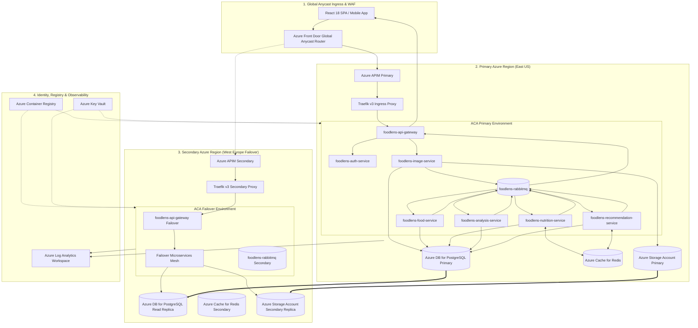
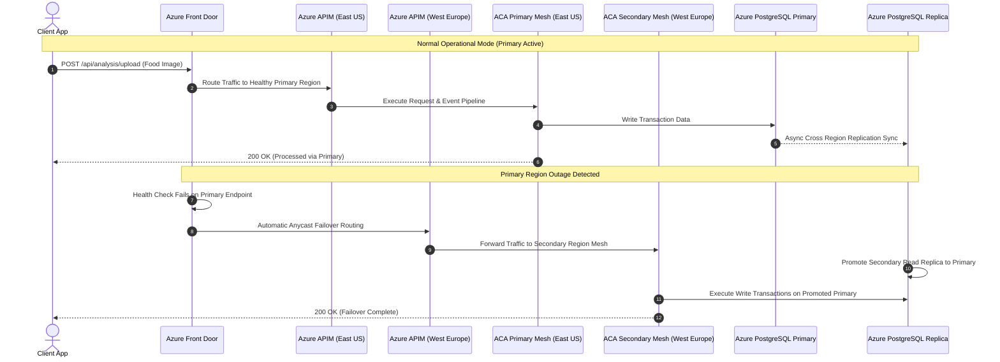

# Azure Multi-Region End-to-End Architecture & Flow Diagram

This document contains visual Mermaid flowchart and sequence diagrams detailing the multi-region active-active/failover architecture, request routing, microservices processing, and data persistence on **Microsoft Azure**.

---

## 📐 1. Azure Multi-Region Architecture & Flowchart Diagram

---

## 🔄 2. Azure Multi-Region Failover Sequence Diagram

