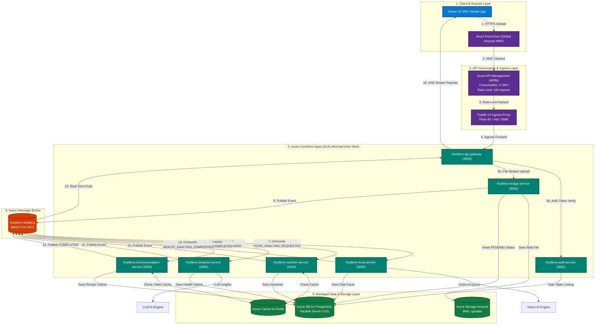
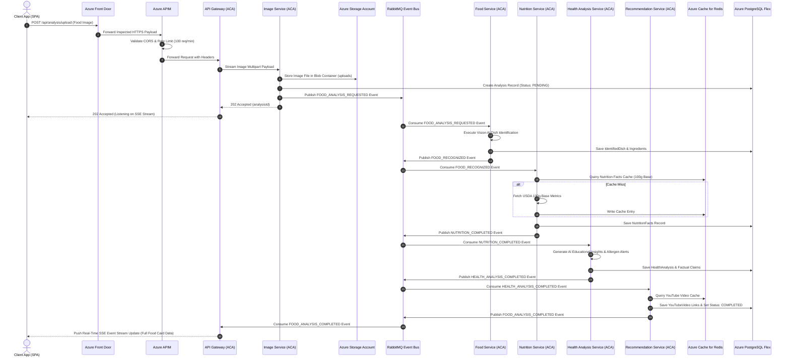

# Azure End-to-End Architecture & Flow Diagram

This document contains visual Mermaid flowchart and sequence diagrams detailing the complete lifecycle of request routing, microservices processing, and data persistence on **Microsoft Azure**.

---

## 📐 1. Full Azure Architecture & Flowchart Diagram

---

## 🔄 2. Azure End-to-End Sequence Diagram

