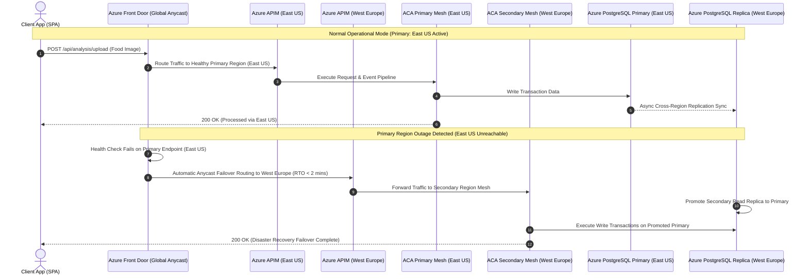

# Azure Multi-Region End-to-End Architecture & Flow Diagram

This document contains visual Mermaid flowchart and sequence diagrams detailing the multi-region active-active/failover architecture, request routing, microservices processing, and data persistence on **Microsoft Azure**.

---

## 📐 1. Azure Multi-Region Architecture & Flowchart Diagram

```mermaid
flowchart TD
    %% Styling
    classDef clientStyle fill:#0078D4,color:#fff,stroke:#004578,stroke-width:2px;
    classDef edgeStyle fill:#5C2D91,color:#fff,stroke:#3B1E5D,stroke-width:2px;
    classDef acaStyle fill:#008272,color:#fff,stroke:#004E44,stroke-width:2px;
    classDef dataStyle fill:#107C41,color:#fff,stroke:#0A4B27,stroke-width:2px;
    classDef secStyle fill:#D83B01,color:#fff,stroke:#8E2600,stroke-width:2px;
    classDef replicaStyle fill:#7A7A7A,color:#fff,stroke:#4A4A4A,stroke-width:2px,stroke-dasharray: 5 5;

    subgraph Anycast_Global ["1. Global Anycast Ingress & WAF"]
        Client["React 18 SPA / Mobile App"]:::clientStyle
        FrontDoor["Azure Front Door (Global Anycast Router)<br/>- Multi-Region Latency & Health Probes<br/>- Web Application Firewall (WAF)"]:::edgeStyle
    end

    subgraph Primary_Region ["2. Primary Azure Region (East US)"]
        APIM_Primary["Azure APIM Primary<br/>(Consumption_0)"]:::edgeStyle
        Traefik_Primary["Traefik v3 Ingress Proxy"]:::edgeStyle
        
        subgraph ACA_Primary ["ACA Primary Environment (VNet: 10.0.0.0/21)"]
            Gateway_P["foodlens-api-gateway (3000)"]:::acaStyle
            Auth_P["foodlens-auth-service (3001)"]:::acaStyle
            Image_P["foodlens-image-service (3002)"]:::acaStyle
            Food_P["foodlens-food-service (3003)"]:::acaStyle
            Nutri_P["foodlens-nutrition-service (3004)"]:::acaStyle
            Analysis_P["foodlens-analysis-service (3005)"]:::acaStyle
            Rec_P["foodlens-recommendation-service (3006)"]:::acaStyle
            Broker_P[("foodlens-rabbitmq (5672)")]:::secStyle
        end

        Postgres_P[("Azure DB for PostgreSQL<br/>Flexible Primary (v15)")]:::dataStyle
        Redis_P[("Azure Cache for Redis")]:::dataStyle
        Storage_P[("Azure Storage Account<br/>(Blob: uploads RA-GRS)")]:::dataStyle
    end

    subgraph Secondary_Region ["3. Secondary Azure Region (West Europe Failover)"]
        APIM_Secondary["Azure APIM Secondary<br/>(Failover Facade)"]:::replicaStyle
        Traefik_Secondary["Traefik v3 Secondary Proxy"]:::replicaStyle
        
        subgraph ACA_Secondary ["ACA Failover Environment (VNet: 10.1.0.0/21)"]
            Gateway_S["foodlens-api-gateway (Failover)"]:::replicaStyle
            Microservices_S["Failover Microservices Mesh<br/>(Auth, Image, Food, Nutri, Analysis, Rec)"]:::replicaStyle
            Broker_S[("foodlens-rabbitmq (Secondary)")]:::replicaStyle
        end

        Postgres_S[("Azure DB for PostgreSQL<br/>Flexible Read Replica")]:::replicaStyle
        Redis_S[("Azure Cache for Redis<br/>(Secondary)")]:::replicaStyle
        Storage_S[("Azure Storage Account<br/>Secondary Replica (RA-GRS)")]:::replicaStyle
    end

    subgraph Security_Monitoring ["4. Identity, Registry & Observability"]
        ACR["Azure Container Registry (ACR)<br/>foodlensdevacr.azurecr.io"]
        KeyVault["Azure Key Vault<br/>foodlensdevkv.vault.azure.net"]
        LogAnalytics["Azure Log Analytics Workspace<br/>foodlens-dev-law"]
    end

    %% Client Routing
    Client -->|1. HTTPS Request| FrontDoor
    FrontDoor -->|2a. Active Path (Primary Health OK)| APIM_Primary
    FrontDoor -.->|2b. Automatic DR Failover| APIM_Secondary

    %% Primary Region Connections
    APIM_Primary --> Traefik_Primary
    Traefik_Primary --> Gateway_P
    Gateway_P --> Auth_P
    Gateway_P --> Image_P
    Image_P --> Storage_P
    Image_P --> Postgres_P
    Image_P --> Broker_P

    Broker_P --> Food_P
    Food_P --> Postgres_P
    Food_P --> Broker_P

    Broker_P --> Nutri_P
    Nutri_P <--> Redis_P
    Nutri_P --> Postgres_P
    Nutri_P --> Broker_P

    Broker_P --> Analysis_P
    Analysis_P --> Postgres_P
    Analysis_P --> Broker_P

    Broker_P --> Rec_P
    Rec_P <--> Redis_P
    Rec_P --> Postgres_P
    Rec_P --> Broker_P

    Broker_P --> Gateway_P
    Gateway_P --> Client

    %% Secondary Region Connections
    APIM_Secondary --> Traefik_Secondary
    Traefik_Secondary --> Gateway_S
    Gateway_S --> Microservices_S
    Microservices_S --> Postgres_S
    Microservices_S --> Storage_S

    %% Cross-Region Data Replication
    Postgres_P ==="Async Cross-Region DB Replication"===> Postgres_S
    Storage_P ==="Geo-Redundant Storage (RA-GRS) Sync"===> Storage_S

    %% Global Assets
    ACR -.->|Pull Container Images| ACA_Primary
    ACR -.->|Pull Container Images| ACA_Secondary
    KeyVault -.->|Inject Secrets| ACA_Primary
    KeyVault -.->|Inject Secrets| ACA_Secondary
    ACA_Primary --> LogAnalytics
    ACA_Secondary --> LogAnalytics
```

---

## 🔄 2. Azure Multi-Region Failover Sequence Diagram


