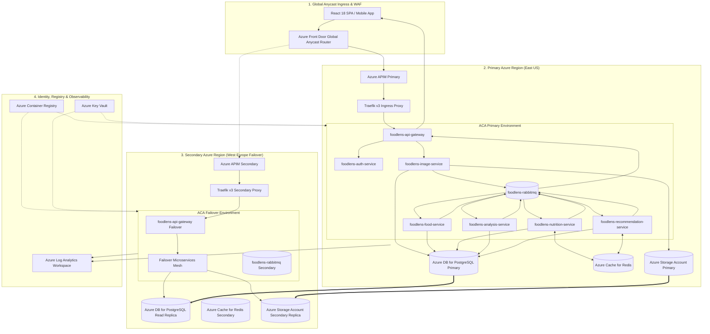

# FoodLens AI - Microsoft Azure Cloud Architecture & Data Flow Guide

This document contains full multi-region architectural specifications, component interaction diagrams, step-by-step data flow sequences, and production guides for **FoodLens AI** on **Microsoft Azure**.

---

## 📋 Azure Resource Inventory & Architecture Reference

Before deploying, review all 25+ Azure resources provisioned via Terraform:

| Resource Name / Type | Azure Service | SKU / Tier | Purpose & Description | Multi-Region Status |
| :--- | :--- | :--- | :--- | :--- |
| `azurerm_resource_group` | Resource Group | Standard | Logical container (`foodlens-dev-rg`) | Primary (`eastus`) / Secondary (`westeurope`) |
| `azurerm_virtual_network` | Virtual Network (VNet) | `10.0.0.0/16` | VNet & Delegated Subnets (ACA: `/21`, DB: `/24`) | Regional Subnets per Region |
| `azurerm_cdn_frontdoor_profile` | Azure Front Door | Standard | Global Anycast Router, Latency Failover & WAF | **Global Anycast Service** |
| `azurerm_api_management` | API Management (APIM) | `Consumption_0` | Serverless API Facade, Rate Limiting (100 req/min) & CORS | Primary & Secondary Facades |
| `azurerm_container_app_environment` | Container Apps Env | Managed VNet | Serverless Container Runtime Environment | Deployed in Both Regions |
| `azurerm_container_app` (x8) | Container Apps | Dynamic Serverless | 8 Microservices (`api-gateway`, `auth`, `image`, etc.) | Active Mesh (`eastus`) / Failover Mesh |
| `azurerm_postgresql_flexible_server` | PostgreSQL Flex | `Standard_B1ms` | Primary PostgreSQL 15 Database (`foodlens_db`) | Primary Write Node (`eastus`) |
| `azurerm_postgresql_flexible_server_replica` | PostgreSQL Replica | `Standard_B1ms` | Async Cross-Region Read Replica Database | Failover Read Replica (`westeurope`) |
| `azurerm_redis_cache` | Azure Cache for Redis | `Basic C0` | Fast Nutrition & Recipe Video Caching Layer | Active Instances per Region |
| `azurerm_storage_account` | Blob Storage | `Standard RA-GRS` | Food Image Uploads (`uploads` container) | Geo-Redundant Storage (RA-GRS) |
| `azurerm_container_registry` | ACR | Premium | Container Image Registry (`foodlensdevacr`) | Geo-Replicated Registry |
| `azurerm_key_vault` | Key Vault | Standard | Secret Management (`foodlensdevkv` for JWT & Passwords) | Replicated Vault Secrets |
| `azurerm_monitor_metric_alert` (x4) | Azure Monitor Alerts | SRE Metric Rules | P1/P2 Golden Signals Alerts (CPU, Memory, 5xx Errors) | Multi-Region Metric Alerts |
| `azurerm_log_analytics_workspace` | Log Analytics | PerGB2018 | Centralized Container Logs & Insights (`foodlens-dev-law`) | Unified Analytics Log Sink |

---

## 🏗️ 1. Azure Multi-Region Architecture Diagram



---

## ⚡ 2. Azure Multi-Region Execution Flow Chart

```
[ Client / React SPA / Mobile App ]
                │
                │ (1. HTTPS Request Payload)
                ▼
  [ Azure Front Door Anycast Router ]
  (Global Health Probes & WAF Shield)
                │
                ├─────────────────────────────────────────────────────────────────────────┐
                │                                                                         │
                ▼ (Primary Route: East US Healthy)                                        ▼ (Disaster Recovery Route: Failover)
  [ Azure APIM Primary (East US) ]                                          [ Azure APIM Secondary (West Europe) ]
                │                                                                         │
                ▼                                                                         ▼
  [ Traefik v3 Primary Proxy ]                                              [ Traefik v3 Secondary Proxy ]
                │                                                                         │
                ▼                                                                         ▼
  [ API Gateway Container App (East US) ]                                   [ API Gateway Container App (West Europe) ]
                │                                                                         │
      ┌─────────┴─────────┐                                                     ┌─────────┴─────────┐
      │                   │                                                     │                   │
      ▼ (Sync Auth)       ▼ (Upload Stream)                                     ▼ (Failover Auth)   ▼ (Failover Upload)
 [ Auth Service ]   [ Image Service ]                                      [ Auth Service ]    [ Image Service ]
      │                   │                                                     │                   │
      ▼                   ▼                                                     ▼                   ▼
 [ Azure Postgres ] [ Azure Storage (Blob) ]                               [ PostgreSQL Replica ] [ Storage Replica (GRS) ]
      (Primary)      (Primary uploads)                                      (Promoted Primary)  (Read-Access Secondary)
                          │                                                                         │
                          ▼ (Publish: FOOD_ANALYSIS_REQUESTED)                                       ▼
             [ RabbitMQ Primary Broker ]                                               [ RabbitMQ Secondary Broker ]
                          │                                                                         │
    ┌─────────────────────┼─────────────────────┐                                   ┌───────────────┼───────────────┐
    ▼                     ▼                     ▼                                   ▼               ▼               ▼
[ Food Service ]   [ Nutrition Service ] [ Analysis Service ]                   [ Food Service ] [ Nutrition Svc ] [ Analysis Svc ]
(Vision AI Engine) (USDA 100g Lookup)  (AI Health Insights)                     (Failover Mesh)  (Failover Mesh)  (Failover Mesh)
    │                     │                     │                                   │               │               │
    ▼                     ▼                     ▼                                   ▼               ▼               ▼
[ Azure Postgres ] [ Azure Redis ]     [ Azure Postgres ]                       [ Postgres Rep ] [ Secondary Redis ] [ Postgres Rep ]
    │                     │                     │                                   │               │               │
    └─────────────────────┼─────────────────────┘                                   └───────────────┼───────────────┘
                          │ (Async Event Chain)                                                     │
                          ▼                                                                         ▼
          [ Recommendation Service (East US) ]                                    [ Recommendation Service (West Europe) ]
          (YouTube Recipe Video Search)                                           (Failover Video Search)
                          │                                                                         │
                          ▼ (Publish: FOOD_ANALYSIS_COMPLETED)                                      ▼
          [ API Gateway Primary Container App ]                                    [ API Gateway Secondary Container App ]
                          │                                                                         │
                          ▼ (Real-Time SSE Event Stream)                                            ▼
            [ Client / React SPA UI ] ──────────────────────────────────────────────────────────────┘
```

---

## 🗺️ 3. Step-by-Step Documentation Index (0 - 15)

0. [00 - Azure Architecture & Flow Diagram](00-architecture-flow-diagram.md): Dedicated visual Mermaid flowcharts and sequence diagrams.
1. [01 - Prerequisites & Tooling Setup](01-prerequisites.md): Install Azure CLI, Terraform, and configure ACR credentials.
2. [02 - Complete Azure Terraform Resources Provisioning](02-terraform-aca-provisioning.md): Detailed breakdown of all 25 Azure resources provisioned via Terraform.
3. [03 - ACA Environment & Revisions Verification](03-aca-environment-verification.md): Verify Container Apps Environment status, revisions, and health.
4. [04 - Key Vault Secrets Integration](04-keyvault-secrets-aca.md): Configure Azure Key Vault secrets and map them to Container Apps environment variables.
5. [05 - Azure PostgreSQL Flexible Server](05-postgresql-flexible-server.md): Provision Azure Database for PostgreSQL Flexible Server (`foodlens_db`).
6. [06 - Traefik v3 Ingress & Custom Domains](06-aca-ingress-custom-domain.md): Configure external HTTPS ingress for API Gateway & Frontend with custom domain binding.
7. [07 - Microservices Communication & DNS](07-microservices-communication.md): Internal microservices routing, internal ingress, and DNS service discovery.
8. [08 - Observability & Log Analytics](08-observability-log-analytics.md): Azure Log Analytics Workspace, App Insights telemetry, and streaming container logs.
9. [09 - PostgreSQL Schema Migrations](09-postgresql-migrations.md): Run Prisma migrations and seed initial data against Azure PostgreSQL.
10. [10 - GitHub Actions CI/CD Pipeline](10-github-actions-ci-cd-aca.md): Configure automated ACR image building and ACA deployment pipeline.
11. [11 - One-Click ACA Deployment Script](11-one-click-aca-deploy.md): Automated one-command deployment and teardown guide.
12. [12 - Azure Multi-Region Active-Active Architecture](12-multi-region-failover.md): Azure Front Door global routing and PostgreSQL Read Replicas.
13. [13 - Azure API Management (APIM) Integration](13-api-management-apim.md): APIM gateway facade, rate limiting policies, and developer portal.
14. [14 - Real-Time Disaster Recovery Failover & Failback Runbook](14-realtime-failover-runbook.md): Operational runbook for live Azure region failover and failback.
15. [15 - Azure SRE Alert Incident Response Runbook](15-sre-alert-incident-runbook.md): SRE operational triage, diagnostic CLI commands, and remediation steps for Azure Monitor metric alerts.
