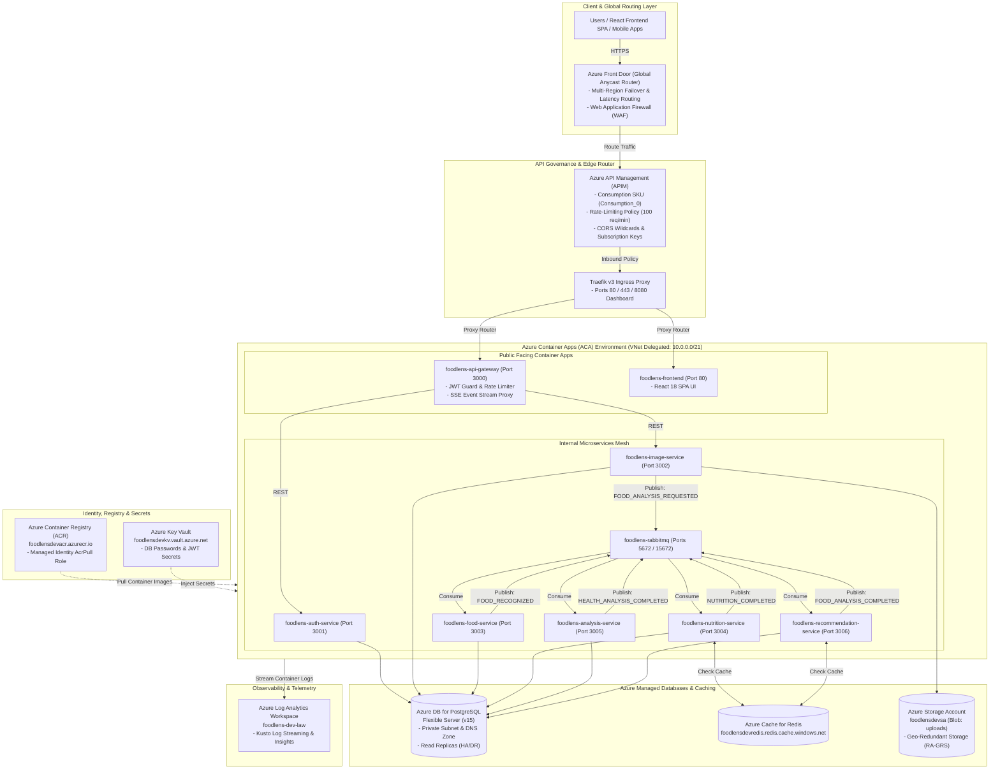

# FoodLens AI - Microsoft Azure Cloud Architecture & Data Flow Guide

This document contains full architectural specifications, component interaction diagrams, step-by-step data flow sequences, and production guides for **FoodLens AI** on **Microsoft Azure**.

---

## 🏗️ 1. Azure Architecture Diagram

---

## 🗺️ Step-by-Step Documentation Index (0 - 13)

0. [00 - Azure Architecture & Flow Diagram](00-architecture-flow-diagram.md): Dedicated visual Mermaid flowcharts and sequence diagrams.
1. [01 - Prerequisites & Tooling Setup](01-prerequisites.md): Install Azure CLI, Terraform, and configure ACR credentials.
2. [02 - Complete Azure Terraform Resources Provisioning](02-terraform-aca-provisioning.md): Detailed breakdown of all 25 Azure resources provisioned via Terraform.
3. [03 - ACA Environment & Revisions Verification](03-aca-environment-verification.md): Verify Container Apps Environment status, revisions, and health.
4. [04 - Key Vault Secrets Integration](04-keyvault-secrets-aca.md): Configure Azure Key Vault secrets and map them to Container Apps environment variables.
5. [05 - Azure PostgreSQL Flexible Server](05-postgresql-flexible-server.md): Provision Azure Database for PostgreSQL Flexible Server (`foodlens_db`).
6. [06 - Traefik v3 Ingress & Custom Domains](06-aca-ingress-custom-domain.md): Configure external HTTPS ingress for API Gateway & Frontend with custom domain binding.
7. [07 - Microservices Communication & DNS](07-microservices-communication.md): Internal microservices routing, internal ingress, and DNS service discovery.
8. [08 - Observability & Log Analytics](08-observability-log-analytics.md): Azure Log Analytics Workspace, App Insights telemetry, and streaming container logs.
9. [09 - PostgreSQL Schema Migrations](09-postgresql-migrations.md): Run Prisma migrations and seed initial data against Azure PostgreSQL.
10. [10 - GitHub Actions CI/CD Pipeline](10-github-actions-ci-cd-aca.md): Configure automated ACR image building and ACA deployment pipeline.
11. [11 - One-Click ACA Deployment Script](11-one-click-aca-deploy.md): Automated one-command deployment and teardown guide.
12. [12 - Azure Multi-Region Active-Active Architecture](12-multi-region-failover.md): Azure Front Door global routing and PostgreSQL Read Replicas.
13. [13 - Azure API Management (APIM) Integration](13-api-management-apim.md): APIM gateway facade, rate limiting policies, and developer portal.
